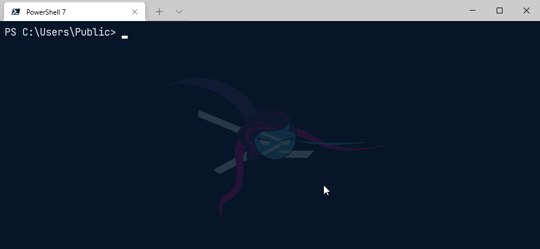
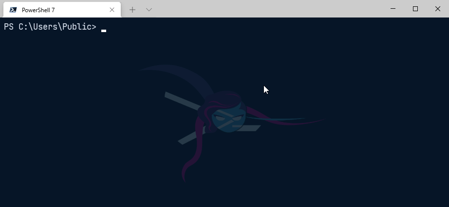

# PS-Menu
Simple module to generate interactive console menus (like yeoman)

# Examples:

```powershell
New-Menu -MenuItems "Option 1", "Option 2", "Option 3"
```
 

Example of a multi-select menu:

 

 Example of a custom message:


# Installation

You can install it from the PowerShellGallery using PowerShellGet

```powershell
Install-Module PS-Menu
```
# Features

* Returns value of selected menu item
* Returns index of selected menu item (using `-ReturnIndex` switch)
* Allows multiple selections and returns an array (using `-MultiSelect` switch)
* Allows displaying a custom message with options
* Navigation with `up/down` arrows
* Navigation with `j/k` (vim style)
* Esc key quits the menu (`null` value returned)

# Contributing

* Source hosted at [GitHub][repo]
* Report issues/questions/feature requests on [GitHub Issues][issues]

## Updating help

Once you have completed your change to the module you will need to regenerate the help files. To do this you will need to have the PlatyPS module installed.
1. Navigate to the root of the project
2. Run the below code.

```powershell
New-ExternalHelp .\ps-menu\docs\ -OutputPath .\ps-menu\en-US\ -Force
Update-MarkdownHelp -Path "C:\Projects\Config\ps-menu\docs\" -AlphabeticParamsOrder -Force
```

Pull requests are very welcome! 
